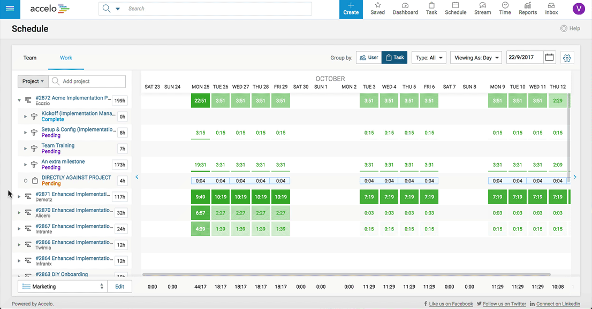
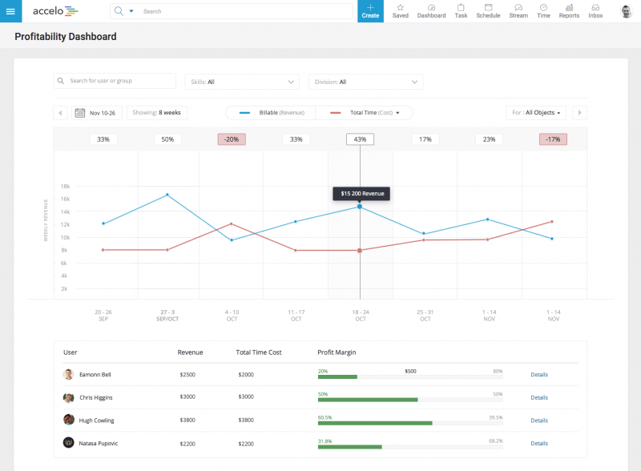
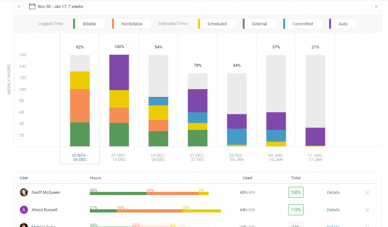
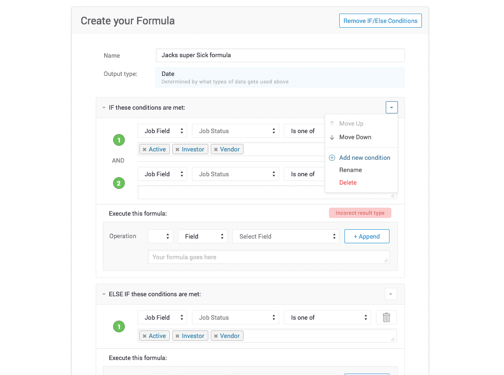
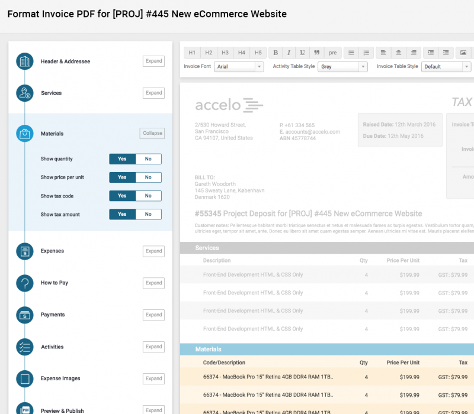
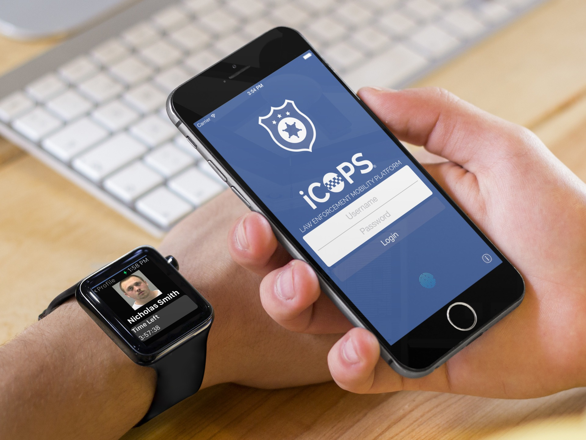
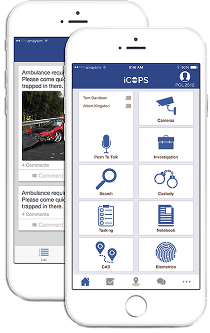

# Victor Chan

## Professional Summary

A software developer with a keen eye for improving developer's productivity and software reliability through tools and design patterns. Experienced in leading, building, and maintaining both web and mobile applications.

Some notable achievements include:
- Led teams to build keynote features in the web application.
- Integrated linting tools into continuous integration to reduce bugs.
- Built libraries to reduce boilerplate code and integrate design patterns.

## Stack

- Languages
	- JavaScript
	- HTML
	- Perl
	- Bash
- Libraries and Frameworks
	- AngularJS
	- ReactJS
	- MySQL
	- NodeJS
	- Express

## Employment History

### Software Developer, Accelo Pty Ltd

- _07/2015 - Current_
- [Accelo](www.accelo.com) is a professional service application that helps small businesses and startups to manage their business administration. They handle things such as invoices, quotations, client relationship management, issues, project management, and many other aspects of running a business. They integrate with other services such as Quickbooks, Xero, Gmail, and Zapier.
	- Web Application Front-end Tech Lead
        - Built and maintained key features such as complex dashboards and formula fields.
        - Managed cross-team collaboration to build new modules and services.
        - Conducted technical talks and training.
        - Conducted technical interviews.
        - Organized book club that led to the clean code movement in the company.
    - Mobile Team Manager
        - Organized communication and workflow between teams to allow for parallel development and releases.
    - Developer Productivity Tech Lead
        - Developed libraries to introduce design patterns across teams.
        - Introduced tools to increase productivity and code reliability.

### Software Developer, Delv Pty Ltd

- _02/2015 - 07/2015_
- [Delv](www.delv.com) is a mobile and infrastructure consulting firm that aids both private corporations and government departments to implement mobile device management (MDM) services for mobile devices issued to their employees. They also design and developed mobile applications for clients according to the required design and development specifications.
    - Prototyped and developed iOS applications according to client specs.
    - Built and managed MongoDB, API endpoints, and web interface for administering the database.

### iOS Developer, Freelance

- _2011 - 2015_
    - Prototyped and designed iOS application according to client specs.
    - Interviewed and gathered requirements and purpose of application.
    - Designed wireframes and mockups for the clients.
    - Development and frequent check-ins with clients.

## Education

- National University Of Singapore, B.Comp
	- _08/2009 – 05/2013_
	- Graduated with Second Upper Honors

## Contact Info

- Phone: +61413827908
- Email: victor.z.chan@gmail.com
- Github: https://github.com/victorzchan

## Projects and Initiatives

### In Accelo

#### Projects

##### Scheduling Dashboard



Built using AngularJS. Decomposed and planned approach for the project. Managed tasks to prevent roadblocks for both frontend and backend teams. Introduced design patterns such as adapters, singletons, selectors and memoization for maintainable and performant code.

##### Profitability and Utilization Dashboards



[Video Preview](https://www.accelo.com/resources/blog/utilization-and-profitability-sneak-peek-webinar/)

Built with AngularJS and D3. The backend data used Perl to handle the API request to get the data from a MySQL database. Implemeneted memoization to minimized the number of requests required to build the graph during pagination. Added animation to provide orientation to the changes in data. Migrated from Fusion Chart to D3 due to performance issues. Due to this project, the other teams took on memoization and D3 in other areas of the application.

##### Formula



Formula was a feature to include some sort of customization to the values in custom fields. It ran the formulas every time a change in the "if" condition happens and executes the formula accordingly. The challenge here was to modify the current code to allow dynamic values. Another challenge was to check for cyclical links, as values of the formulas can be used as part of a condition, and also type checking to make sure that the return value is of the expected type. It was implemented with AngularJS for frontend work with Perl retrieving data from MySQL on the backend.

##### Generate PDFs for Invoice


[Video Preview](https://www.accelo.com/resources/blog/new-invoicing-upgrade-now-live/)

Allowed users to preview and generate pdfs from the settings provided. These includes turning on/off certain fields and changing the columns and contents of each section. Used `wkhtmltopdf` to generate the pdf and QT browser for debugging and generating a preview of the pdf for development. Also handled HTML sanitization as the users are able to customize with HTML allocated sections of the invoice with a rich text editor using `textAngular`.

#### Initiatives

##### Book Club (Leading To Clean Code Movement)

Started book club in Accelo in order to push for self-improvement and continuous learning through reading. Started Clean Code movement in Accelo, rising up to being one of the code reviewers and continuously providing feedback and motivation on making codes cleaner, and thus more readable. In doing so, created a more pleasant environment to work in because developers do not have to waddle through dirty codes in order to extend a feature or fix a bug.

##### ESLint custom plugins

Experimented with having a style guide to have consistent code, but that was unscalable. Introduced linters, with `ESLint` for JavaScript linting. Wrote additional rules as plugins into ESLint to allow for Accelo-specific coding styles. One of such rule is to prevent avoided functions from being used. Our particular set of functions is as shown below. Created it in such a way that it is easily extendable and educational at the same time. 
```
"accelo/no-avoided-function": ["warn", {
	"avoidedFunctions": {
		"xdescribe": "jasmine.xdescribe() - We do not want skipped test to go into master",
		"xit": "jasmine.xit() - We do not want skipped test to go into master",
		"fdescribe": "jasmine.fdescribe() - This causes other tests not to be ran",
		"fit": "jasmine.fit() - This causes other tests not to be ran",
		"success": "$http.success() - Deprecated. Use then/catch pair instead",
	}
}],
```

##### Sublime Build Systems

Implemented build systems into Sublime and shared it with the rest of the team. Before these build systems existed, developers had to go into a terminal in order to run the grunt task to build or to restart Apache on their virtual machines. With the build systems in place, it saved developers time and attention as they do not need to switch context in the midst of coding.

### In Delv

#### Projects

##### [iCops](http://www.icops.com/)




The purpose of iCops was to sell it to the police departments in Australia to promote the use of mobile technology in the law enforcement industry. Features include arrest time tracking and handling in-processing procedures, push-to-talk, live video streaming from security cameras, and connecting with the community using a closed social media group.

Sole developer of iCops, which includes both the iPhone and Apple Watch App. During the development of iCops, experimented with many technologies, including RTSP for live video streaming, iBeacon for indoor location tracking and push-to-talk.

#### Initiatives

In Delv, there were no ticket management systems or version control. Started using Trello board to organize the features and sprints. Pushed the company to use Bitbucket with Git as a version control tool and repository. Introduced the concept of code reviews to exchange information and help others improve.

### Independent Works

Seeks self-improvement during freetime by going to meetups, joining online communities, exploring different ideas, and reading books. Attended ng-sydney meetups and encourage colleagues to attend in order to keep up-to-date with the latest trends in AngularJS. Read and supported to open source book such as [Practical ES6](https://github.com/mjavascript/practical-es6) and [You Don't Know Javascript series](https://github.com/getify/You-Dont-Know-JS).
